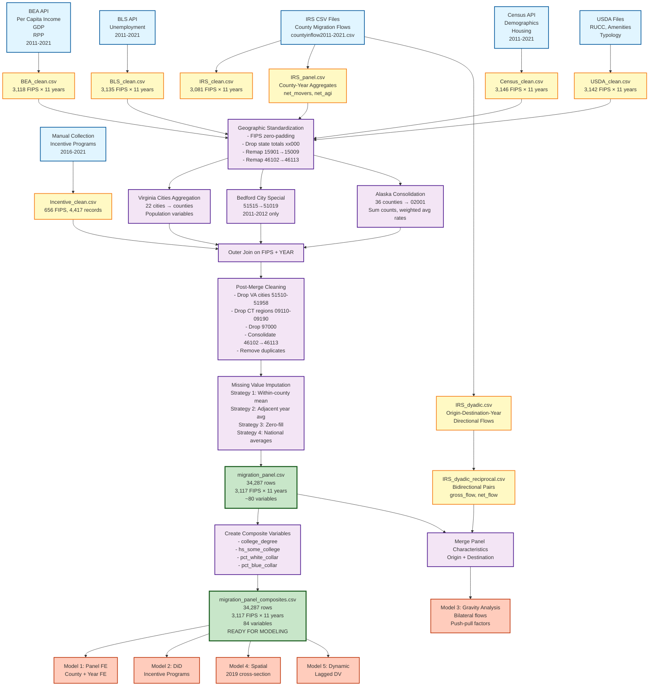

# Migration Data Processing Map

## Key
- **Blue boxes**: Raw data sources (APIs, CSVs)
- **Yellow boxes**: Cleaned individual datasets
- **Purple boxes**: Processing steps (joins, aggregations)
- **Green boxes**: Final analysis-ready datasets
- **Orange boxes**: Statistical models

## Viewing Options
1. GitHub: Will auto-render the diagram
2. VS Code: Install 'Markdown Preview Mermaid Support' extension
3. Online: Copy code to https://mermaid.live/
4. Jupyter: Create markdown cell and paste the mermaid block
